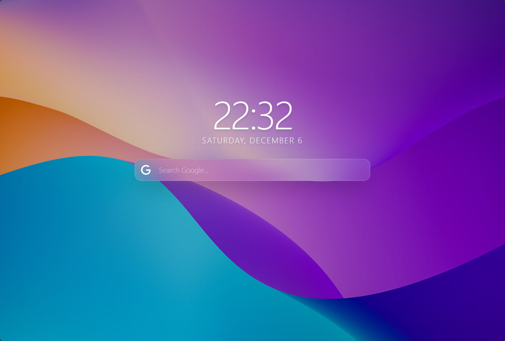
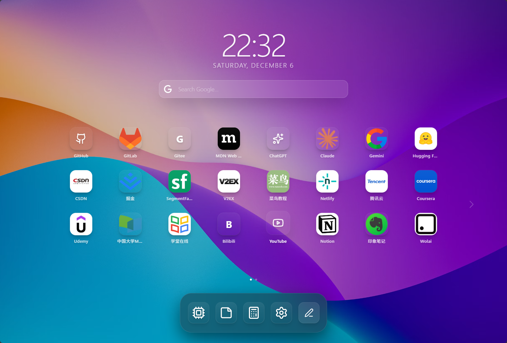
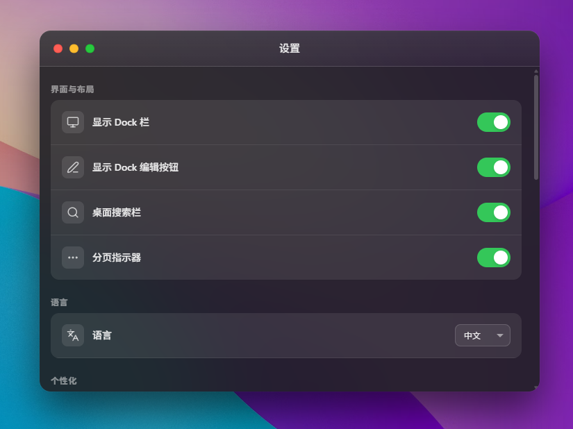

<div align="center">

# 🌿 GrassTab

**一个美观、强大的浏览器新标签页扩展**

[](https://opensource.org/licenses/MIT)
[](https://chrome.google.com/webstore)
[](https://microsoftedge.microsoft.com/addons)
[](https://www.typescriptlang.org/)
[](https://reactjs.org/)

**✨ 专为程序员和学生打造的美观新标签页扩展**

### [🌐 在线预览 Demo](https://moduqishi.github.io/grasstab/)

</div>

---

## ✨ 特性

### 🎨 **美观的设计**
- 🌅 精美的背景壁纸支持
- 🎭 流畅的动画效果和过渡
- 🌓 优雅的视觉体验
- 📱 **完美的响应式布局** - 支持桌面、平板、手机等各种设备
- 🖐️ **触摸优化** - 针对触摸设备优化的交互体验

### 🚀 **强大的功能**
- 📌 **自定义快捷方式** - 添加您最常用的网站，支持自定义图标
- 🔍 **智能搜索栏** - 集成 Google、Bing、Baidu 搜索引擎，带实时搜索建议
- 🪟 **窗口化应用** - 内置计算器、笔记、AI 助手等实用工具
- 📊 **自定义小部件** - 时钟、日历、天气等多种小组件
- 🎯 **拖拽排序** - 自由调整图标位置和大小
- 📄 **多页面支持** - 智能分页，容纳更多快捷方式
- 📷 **多源图标系统** - 7层降级策略，确保每个网站都有最佳图标显示

### 🛠️ **高度可定制**
- 🎨 自定义壁纸
- 🌐 多语言支持（中文/English）
- 💾 导入/导出配置
- ⚙️ 丰富的设置选项

---

## 📸 截图

<div align="center">

### 主界面


### 应用视图


### 设置面板


</div>

---

## 🚀 快速开始

### 安装扩展

#### Chrome
1. 访问 [Chrome Web Store](#)
2. 点击"添加至 Chrome"
3. 打开新标签页，享受 GrassTab！

#### Edge
1. 访问 [Edge Add-ons](#)
2. 点击"获取"
3. 打开新标签页，开始使用！

### 从源码安装

```bash
# 克隆仓库
git clone https://github.com/moduqishi/grasstab-next.git
cd grasstab-next

# 安装依赖
npm install

# 开发模式
npm run dev

# 构建生产版本
npm run build
```

### 加载到浏览器

#### Chrome / Edge
1. 运行构建脚本
   ```bash
   # Windows
   .\tools\build-extension.bat
   ```
2. 打开浏览器访问 `chrome://extensions/` 或 `edge://extensions/`
3. 启用"开发者模式"
4. 点击"加载已解压的扩展程序"
5. 选择 `chrome-extension` 文件夹

---

## 🛠️ 技术栈

- **框架**: React 19.2
- **语言**: TypeScript 5.8
- **构建工具**: Vite 6.2
- **样式**: Tailwind CSS 3.4
- **图标**: Lucide React
- **配置**: YAML Support

---

## 📁 项目结构

```
GrassTab/
├── components/          # React 组件
│   ├── apps/           # 内置应用
│   └── widgets/        # 小部件
├── hooks/              # 自定义 Hooks
├── tools/              # 构建工具和脚本
├── doc/                # 文档
├── _locales/           # 多语言支持
│   ├── zh/            # 简体中文
│   └── en/            # 英文
├── App.tsx             # 主应用组件
├── constants.tsx       # 常量定义
├── types.ts            # TypeScript 类型
├── utils.ts            # 工具函数
└── manifest.json       # 扩展清单
```

---

## ⚙️ 配置

GrassTab 支持通过 YAML 配置文件导入/导出所有设置：

```yaml
version: '1.0'
settings:
  showSearchBar: true
  showPagination: true
  showDock: true
  language: zh
wallpaper: 'https://example.com/wallpaper.jpg'
shortcuts:
  - id: github
    title: GitHub
    url: https://github.com
    type: github
    color: from-gray-900 to-black
```

---

## 🌟 核心功能详解

### 🔍 智能搜索
- 支持 Google、Bing、Baidu 三大搜索引擎
- 实时搜索建议
- 快捷键支持（上下箭头选择，Enter 搜索）
- 一键切换搜索引擎

### 📌 快捷方式管理
- 支持 100+ 预设网站图标
- 自动获取网站 Favicon
- 自定义图标上传
- 拖拽调整位置和大小
- 智能分页算法

### 🪟 内置应用
- **计算器**: 科学计算器，支持键盘操作
- **笔记**: 实时保存的记事本
- **AI 助手**: AI 聊天界面（可接入 API）
- **网页视图**: 在窗口中嵌入任意网页

### 🎨 自定义主题
- 精选壁纸库
- 自定义壁纸 URL
- 完整的颜色系统
- 毛玻璃效果

---

## 🤝 贡献

欢迎提交 Pull Request！对于重大更改，请先开 Issue 讨论您想要改变的内容。

### 开发流程

1. Fork 本仓库
2. 创建您的特性分支 (`git checkout -b feature/AmazingFeature`)
3. 提交您的更改 (`git commit -m 'Add some AmazingFeature'`)
4. 推送到分支 (`git push origin feature/AmazingFeature`)
5. 开启一个 Pull Request

---

## 📱 移动端支持

GrassTab 已完全适配移动设备！

### 功能特性
- ✅ **响应式布局** - 自动适应不同屏幕尺寸
- ✅ **触摸优化** - 所有交互针对触摸操作优化
- ✅ **手势支持** - 支持拖拽、长按等手势操作
- ✅ **全屏窗口** - 移动端应用自动全屏显示
- ✅ **安全区域** - 完美适配刘海屏等特殊屏幕

### 测试方法

#### 本地调试
```bash
# 启动开发服务器
npm run dev

# 或使用移动端调试脚本（Windows）
dev-mobile.bat
```

#### 设备测试
1. 确保手机和电脑在同一 WiFi 网络
2. 记录显示的局域网地址（如: `http://192.168.1.100:5173`）
3. 在手机浏览器中访问该地址
4. （推荐）添加到主屏幕获得最佳体验

### 详细文档
- 📖 [移动端适配说明](MOBILE-ADAPTATION.md)
- ✅ [移动端测试清单](MOBILE-TEST-CHECKLIST.md)

---

## 📷 多源图标系统

GrassTab 采用智能的7层图标降级策略，确保每个网站都能显示最佳图标。

### 图标优先级

1. **icon.horse** ⭐⭐⭐⭐⭐ - 高质量、广泛覆盖
2. **Clearbit** ⭐⭐⭐⭐⭐ - 商标级质量
3. **unavatar.io** ⭐⭐⭐⭐ - 多源聚合
4. **Google Favicon** ⭐⭐⭐ - 可靠但质量一般
5. **DuckDuckGo** ⭐⭐⭐⭐ - 隐私友好
6. **Favicon Kit** ⭐⭐⭐⭐ - API可定制
7. **Direct** ⭐⭐ - 直接获取

### 自动降级机制

当一个图标源加载失败时，系统会自动切换到下一个优先级的源，最终降级到文字图标。这确保了：

- ✅ 最佳图标质量
- ✅ 高可用性（多个备选源）
- ✅ 优雅降级（永不显示损坏图标）
- ✅ 性能优化（浏览器缓存）

### 详细文档
- 📖 [图标系统完整说明](ICON-SYSTEM.md)

---

## 📝 开发路线图

- [x] 多源图标系统
- [x] 移动端完美适配
- [ ] 添加更多小部件（天气、RSS 订阅等）
- [ ] 主题市场
- [ ] 云端同步
- [ ] Firefox 支持
- [ ] 更多内置应用
- [ ] 数据统计面板
- [ ] 快捷键自定义

---

## 📄 许可证

本项目采用 MIT 许可证 - 查看 [LICENSE](LICENSE) 文件了解详情

---

## 🙏 致谢

- [React](https://reactjs.org/) - UI 框架
- [Vite](https://vitejs.dev/) - 构建工具
- [Tailwind CSS](https://tailwindcss.com/) - CSS 框架
- [Lucide](https://lucide.dev/) - 图标库
- [Unsplash](https://unsplash.com/) - 精美壁纸

---

## 📮 联系方式

- GitHub: [@moduqishi](https://github.com/moduqishi)
- Issues: [GitHub Issues](https://github.com/moduqishi/grasstab/issues)

---

<div align="center">

**如果这个项目对您有帮助，请给它一个 ⭐️！**

Made with ❤️ by [moduqishi](https://github.com/moduqishi)

</div>
