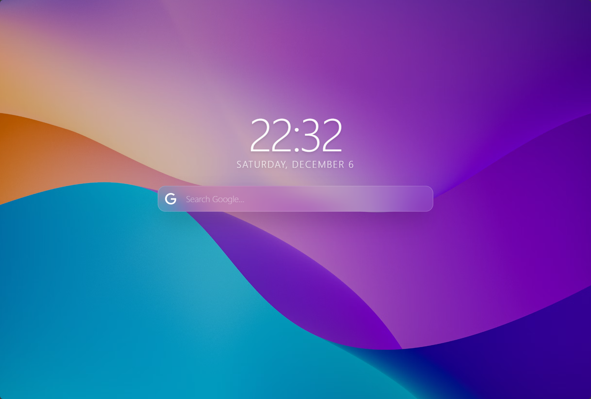
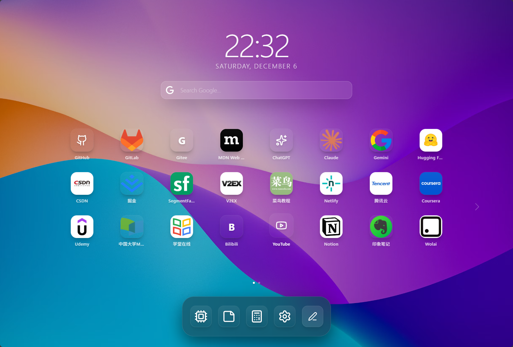
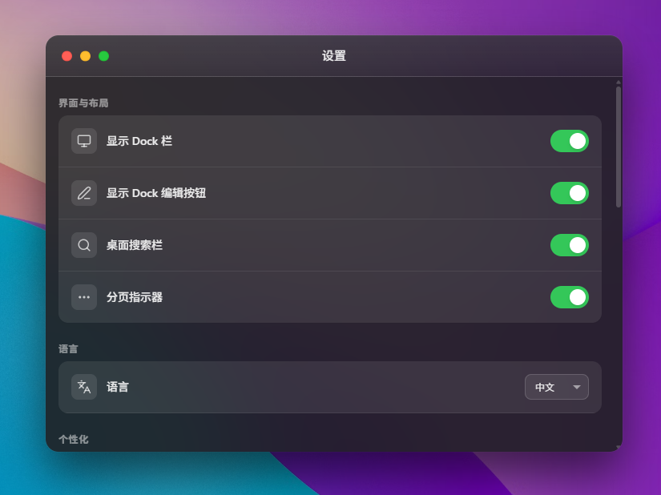

<div align="center">

# 🌿 GrassTab

**一个美观、强大的浏览器新标签页扩展**

[](https://opensource.org/licenses/MIT)
[](https://chrome.google.com/webstore)
[](https://microsoftedge.microsoft.com/addons)
[](https://www.typescriptlang.org/)
[](https://reactjs.org/)
[](https://vitejs.dev/)

**✨ 专为程序员和学生打造的美观新标签页扩展**

### [🌐 在线预览 Demo](https://moduqishi.github.io/grasstab/)

</div>

---

## ✨ 特性

### 🎨 **美观的设计**
- 🌅 **沉浸式壁纸** - 支持 Unsplash 精选壁纸和自定义图片
- 🎭 **流畅动画** - 基于 Framer Motion 的优雅交互体验
- 🌓 **视觉体验** - 精心调配的毛玻璃效果和色彩系统
- 📱 **响应式布局** - 完美适配桌面、平板和移动设备
- 🖐️ **触摸优化** - 针对触摸屏设备优化的手势操作

### 🚀 **强大的功能**
- 📌 **快捷方式** - 自由添加网站图标，支持拖拽排序和文件夹管理
- 🔍 **智能搜索** - 集成 Google/Bing/Baidu，支持实时搜索建议
- 🪟 **窗口化应用** - 内置计算器、笔记、VS Code (Web)、AI 助手等实用工具
- 📊 **桌面小部件** - 时钟、日历、天气等实用桌面组件
- 📄 **多屏分页** - 像手机一样管理你的应用图标
- 📷 **智能图标** - 7层降级策略，确保每个网站都能自动获取最佳图标

### 🛠️ **高度可定制**
- 🎨 主题切换
- 🌐 多语言支持（简体中文/English）
- 💾 YAML 配置导入/导出
- ⚡ 快捷键支持

---

## 📸 截图

<div align="center">

### 主界面


### 应用视图


### 设置面板


</div>

---

## 🚀 快速开始

### 📥 安装扩展

#### Chrome / Edge (手动安装)
目前扩展正在商店审核中，您可以手动安装：

1. 下载最新发布的 `chrome-extension.zip` (见 Releases 页面) 并解压。
2. 打开浏览器扩展管理页面：
   - Chrome: `chrome://extensions/`
   - Edge: `edge://extensions/`
3. 开启右上角的 **"开发者模式"**。
4. 点击 **"加载已解压的扩展程序"**。
5. 选择解压后的文件夹。

### 💻 本地开发

#### 环境要求
- Node.js >= 18
- npm 或 yarn

#### 步骤

```bash
# 1. 克隆仓库
git clone https://github.com/moduqishi/grasstab-next.git
cd grasstab-next

# 2. 安装依赖
npm install

# 3. 启动开发服务器 (网页预览模式)
npm run dev
# 访问 http://localhost:5173 进行预览
```

#### 构建扩展

```bash
# 构建 Chrome 扩展格式
npm run build:extension

# 构建完成后，在 dist/chrome-extension 目录生成扩展文件
```

---

## 🛠️ 技术栈

本项目使用最新的现代前端技术构建：

- **核心框架**: [React 19.2](https://react.dev/) + [TypeScript 5.8](https://www.typescriptlang.org/)
- **构建工具**: [Vite 6.2](https://vitejs.dev/)
- **样式方案**: [Tailwind CSS 3.4](https://tailwindcss.com/) + PostCSS
- **动画引擎**: [Framer Motion 12](https://www.framer.com/motion/)
- **编辑器组件**: [Monaco Editor](https://microsoft.github.io/monaco-editor/) (用于笔记和代码编辑)
- **图标库**: [Lucide React](https://lucide.dev/)
- **配置解析**: [js-yaml](https://github.com/nodeca/js-yaml)

---

## 📁 项目结构

```
GrassTab/
├── components/          # React UI 组件
│   ├── apps/           # 窗口化应用程序 (Calculator, Notes, etc.)
│   ├── widgets/        # 桌面小部件 (Clock, Weather, etc.)
│   └── ui/             # 基础 UI 组件
├── hooks/              # 自定义 React Hooks
├── tools/              # 构建和辅助脚本
├── doc/                # 项目文档和资源
├── _locales/           # Chrome 扩展多语言文件
├── src/
│   ├── App.tsx         # 根组件
│   ├── main.tsx        # 入口文件
│   └── index.css       # 全局样式 (Tailwind)
├── public/             # 静态资源
└── manifest.json       # 扩展清单文件 V3
```

---

## ⚙️ 配置系统

GrassTab 的核心配置（布局、图标、壁纸）均可以通过 YAML 格式导出和导入，方便备份和迁移。

**示例配置:**

```yaml
version: '1.0'
settings:
  language: zh
  wallpaper: 'https://images.unsplash.com/photo-1...'
  blurStrength: 'medium'
shortcuts:
  - id: 'github'
    title: 'GitHub'
    url: 'https://github.com'
    icon: 'github'
```

---

## 🤝 贡献指南

我们非常欢迎社区贡献！如果您发现 Bug 或有新功能的想法：

1. 在 Issues 中提交反馈。
2. Fork 本仓库并创建分支。
3. 提交 PR，我们会尽快审核。

---

## 📄 许可证

本项目基于 [MIT 许可证](LICENSE) 开源。

---

<div align="center">

**如果这个项目对您有帮助，请给它一个 ⭐️！**

Made with ❤️ by [moduqishi](https://github.com/moduqishi)

</div>
